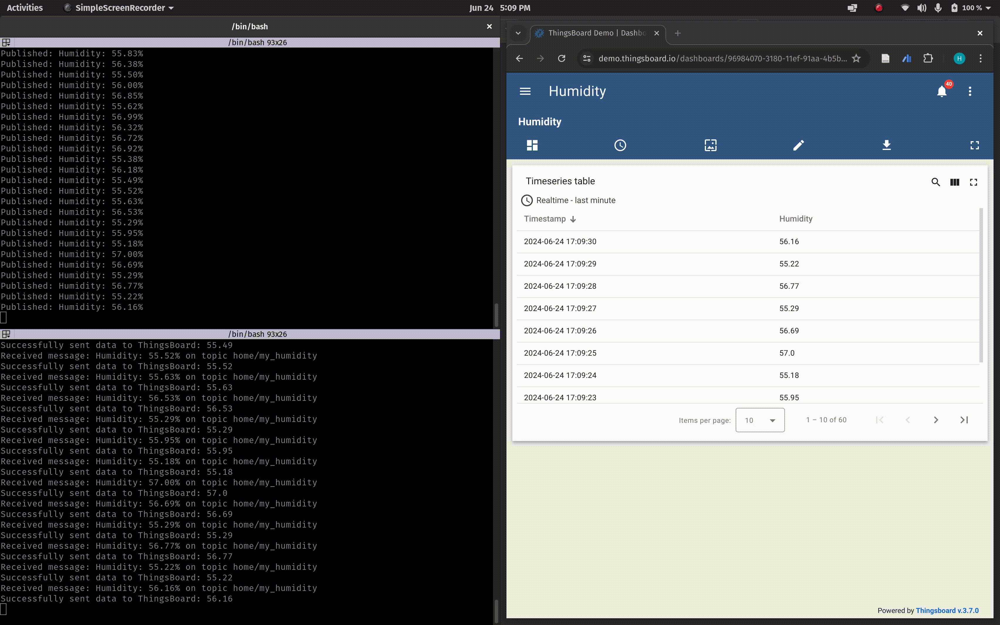

# humidity_scanner

## Project Description

`humidity_scanner` is an IoT project that consists of an MQTT publisher and subscriber. The publisher simulates humidity sensor data and sends it to an MQTT broker. The subscriber receives this data and stores it locally if there is no internet connection. Once the connection is restored, the subscriber forwards the data to a ThingsBoard server for visualization.

The project has the following:
- MQTT for communication between the publisher and subscriber.
- SQLite for local data storage when the internet is unavailable.
- ThingsBoard for data visualization.
- YAML for configuration management.


## Setup Instructions

### Clone the Repository
```
$ git clone https://github.com/hamsadatta/humidity_scanner.git

$ cd humidity_scanner
```
Install Dependencies:
```
$ pip install -r requirements.txt
```

### Configuration

1. **config.yaml**: Update the `config.yaml` file with your specific configuration details:

```yaml
mqtt:
  broker_address: "broker.hivemq.com"
  broker_port: 1883
  topic: "home/humidity17"

thingsboard:
  broker_address: "demo.thingsboard.io"
  broker_port: 1883
  access_token: "YOUR_THINGSBOARD_ACCESS_TOKEN"
  telemetry_topic: "v1/devices/me/telemetry"
```
### Running the Project
Publisher
The publisher simulates humidity data and publishes it to an MQTT topic.
```
$ python3 publisher/publisher.py
```

Subscriber
The subscriber receives humidity data from the MQTT broker, stores it locally when offline, and sends it to ThingsBoard when the connection is available.
```
$ python3 subscriber/subscriber.py
```
### ThingsBoard Public Dashboard
You can view already simulated data at public [dashboard](https://demo.thingsboard.io/dashboard/96984070-3180-11ef-91aa-4b5b857befbc?publicId=726749a0-3232-11ef-91aa-4b5b857befbc)
